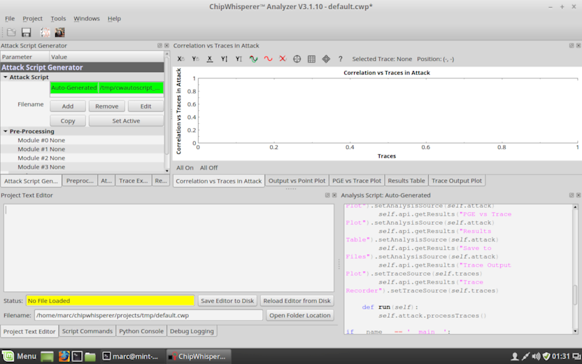

Install chipwhisperer-marc on Linux Mint 18
===========================================

This tutorial has been tested with a fresh Linux Mint 18 system in VMWare
(4GB RAM, 20GB disk).

Step 1: Install dependencies
----------------------------

Open a root shell (`sudo su -`) and execute:

>	apt-get update  
>	apt-get install git git-doc gcc build-essential python2.7 python2.7-dev
                    libpython2.7 python-numpy python-scipy python-pyside
                    python-configobj python-setuptools python-pip libpng12-dev
                    libfreetype6-dev liblapack-dev gfortran   
>	
>   pip install --upgrade pip pyqtgraph docutils matplotlib numpy scipy  
>	pip install pyusb --pre  

Step 2: Install chipwhisperer-marc
----------------------------------

In a user shell (not root), execute:

>	cd ~/  
>	git clone https://github.com/marc-invalid/chipwhisperer-marc.git  
>	cd chipwhisperer-marc  
>	git clone git://git.assembla.com/openadc.git  
>	
>	cd software  
>	sudo python2.7 setup.py develop ; echo $?  
>	cd ../openadc/controlsw/python  
>	sudo python2.7 setup.py develop ; echo $?  
>	cd ../../..  

Step 3: Allow user access to CW1002 USB hardware (optional)
-----------------------------------------------------------

As root, execute:

>	vi /etc/udev/rules.d/99-ztex.rules  

>>	
>>	# MARC: ChipWhisperer: allow users to claim the device  
>>	SUBSYSTEM=="usb", ATTRS{idVendor}=="04b4", ATTRS{idProduct}=="8613", MODE="0664", GROUP="plugdev"  
>>	SUBSYSTEM=="usb", ATTRS{idVendor}=="221a", ATTRS{idProduct}=="0100", MODE="0664", GROUP="plugdev"  

>	vi /etc/udev/rules.d/99-avrisp.rules  

>>	
>>	# MARC: ChipWhisperer: allow users to claim the device  
>>	SUBSYSTEM=="usb", ATTRS{idVendor}=="03eb", ATTRS{idProduct}=="2104", MODE="0664", GROUP="plugdev"  

>	usermod -a -G plugdev marc   # __(use YOUR username!)__    
>	udevadm control --reload-rules  

You have may have to logout of the current session for this to
become active.

Note about USB in VMWare: The guest window must be active while
you plug the device in, otherwise it may be assigned to the host
instead of the guest. Also, sometimes it doesn't work at the
first attempt.

Step 4: Run the program
------------------------------------------------------

Run either of these, in a user shell:

>	cd ~/chipwhisperer-marc/software  

>	python2.7 CWCapture.pyw  
>	python2.7 CWAnalyzer.pyw  

________________________________________________________________________

_Document author: marc_ - _Document version: 11-Oct-2016_ - [Fork README](../../../README.md)
